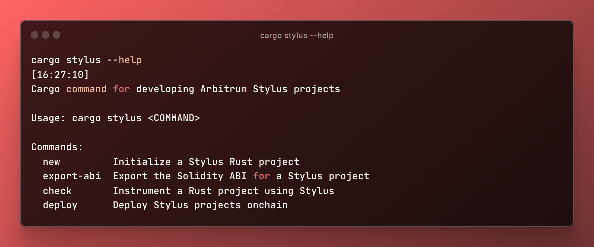

# Cargo Stylus

[](https://github.com/OffchainLabs/cargo-stylus/actions/workflows/linux.yml) [](https://github.com/OffchainLabs/cargo-stylus/actions/workflows/mac.yml) [](https://github.com/OffchainLabs/cargo-stylus/actions/workflows/windows.yml) [](https://github.com/OffchainLabs/cargo-stylus/actions/workflows/check.yml)

A cargo subcommand for building, verifying, and deploying Arbitrum Stylus WASM contracts in Rust.

## Quick Start



### Installing With Cargo

Install [Rust](https://www.rust-lang.org/tools/install), and then install the plugin using the Cargo tool:

```
cargo install --force cargo-stylus cargo-stylus-check
```

Add the `wasm32-unknown-unknown` build target to your Rust compiler:

```
rustup target add wasm32-unknown-unknown
```

You should now have it available as a Cargo subcommand:

```
cargo stylus --help

Cargo command for developing Arbitrum Stylus projects

Usage:
    cargo stylus new
    cargo stylus export-abi
    cargo stylus check
    cargo stylus deploy
```

### Building the Project Locally
Install [Rust](https://www.rust-lang.org/tools/install)

Clone the repo to your local device
```
git clone https://github.com/OffchainLabs/cargo-stylus.git
cd cargo-stylus
```

Run the `install.sh` script to build and install the local binaries to cargo
```
./install.sh
```

Add the `wasm32-unknown-unknown` build target to your Rust compiler:
```
rustup target add wasm32-unknown-unknown
```

When testing changes to your local repository, ensure that commands such as `cargo stylus deploy` are run with the `--no-verify` flag to opt out of using Docker

If your changes are localized to a single package, you can avoid building and reinstalling all packages by running
```
cargo install --path <workspace_pkg_with_changes>
```

### Overview

The cargo stylus command comes with useful commands such as `new`, `check` and `deploy`, and `export-abi` for developing and deploying Stylus contracts to Arbitrum chains. Here's a common workflow:

Start a new Stylus project with

```
cargo stylus new <YOUR_PROJECT_NAME>
```

The command above clones a local copy of the [stylus-hello-world](https://github.com/OffchainLabs/stylus-hello-world) starter project, which implements a Counter smart contract in Rust. See the [README](https://github.com/OffchainLabs/stylus-hello-world/blob/main/README.md) of stylus-hello-world for more details.

You can also use `cargo stylus new --minimal <YOUR_PROJECT_NAME>` to create a more barebones example with a Stylus entrypoint locally.

### Testnet Information

All testnet information, including faucets and RPC endpoints can be found [here](https://docs.arbitrum.io/stylus/reference/testnet-information).


### Developing With Stylus

Then, develop your Rust contract normally and take advantage of all the features the [stylus-sdk](https://github.com/OffchainLabs/stylus-sdk-rs) has to offer. To check whether or not your contract will successfully deploy and activate onchain, use the `cargo stylus check` subcommand:

```
cargo stylus check
```

This command will attempt to verify that your contract can be deployed and activated onchain without requiring a transaction by specifying a JSON-RPC endpoint. By default, it will use the public URL of the Stylus testnet as its endpoint. See [here](https://docs.arbitrum.io/stylus/reference/testnet-information) for available testnet RPC URLs. See `cargo stylus check --help` for more options.

If the command above fails, you'll see detailed information about why your WASM will be rejected:

```
Reading WASM file at bad-export.wat
Compressed WASM size: 55 B
Stylus checks failed: contract predeployment check failed when checking against
ARB_WASM_ADDRESS 0x0000…0071: (code: -32000, message: contract activation failed: failed to parse contract)

Caused by:
    binary exports reserved symbol stylus_ink_left

Location:
    prover/src/binary.rs:493:9, data: None)
```

To read more about what counts as valid vs. invalid user WASM contracts, see [VALID_WASM](./check/VALID_WASM.md).

If your contract succeeds, you'll see the following message:

```
Finished release [optimized] target(s) in 1.88s
Reading WASM file at hello-stylus/target/wasm32-unknown-unknown/release/hello-stylus.wasm
Compressed WASM size: 3 KB
Contract succeeded Stylus onchain activation checks with Stylus version: 1
```

Once you're ready to deploy your contract onchain, you can use the `cargo stylus deploy` subcommand as follows:

First, we can estimate the gas required to perform our deployment and activation with:

```
cargo stylus deploy \
  --private-key-path=<PRIVKEY_FILE_PATH> \
  --estimate-gas-only
```

and see:

```
Compressed WASM size: 3 KB
Deploying contract to address 0x457b1ba688e9854bdbed2f473f7510c476a3da09
Estimated gas: 12756792
```

Next, attempt an actual deployment. Two transactions will be sent onchain.

```
cargo stylus deploy \
  --private-key-path=<PRIVKEY_FILE_PATH>
```

and see:

```
Compressed WASM size: 3 KB
Deploying contract to address 0x457b1ba688e9854bdbed2f473f7510c476a3da09
Estimated gas: 12756792
Submitting tx...
Confirmed tx 0x42db…7311, gas used 11657164
Activating contract at address 0x457b1ba688e9854bdbed2f473f7510c476a3da09
Estimated gas: 14251759
Submitting tx...
Confirmed tx 0x0bdb…3307, gas used 14204908
```

## Compiling and Checking Stylus Contracts

**cargo stylus check**

Instruments a Rust project using Stylus. This command runs compiled WASM code through Stylus instrumentation checks and reports any failures. It **verifies the contract can compile onchain** by making an eth_call to a Arbitrum chain RPC endpoint.

```
Usage: cargo stylus check [OPTIONS]
```

See `--help` for all available flags and default values.

## Deploying Stylus Contracts

**cargo stylus deploy**

Instruments a Rust project using Stylus and by outputting its brotli-compressed WASM code. Then, it submits **two transactions** by default: the first **deploys** the WASM contract code to an address and the second triggers an **activation onchain**. Developers can choose to split up the deploy and activate steps via this command as desired.

```
Usage: cargo stylus deploy [OPTIONS]
```

See `--help` for all available flags and default values.

## Verifying Stylus Contracts

See [here](https://hackmd.io/bpeMnrzbSvO4mohhvkrKqw)

## Deploying Non-Rust WASM Projects

The Stylus tool can also be used to deploy non-Rust, WASM projects to Stylus by specifying the WASM file directly with the `--wasm-file` flag to any of the cargo stylus commands.

Even WebAssembly Text [(WAT)](https://www.webassemblyman.com/wat_webassembly_text_format.html) files are supported. This means projects that are just individual WASM files can be deployed onchain without needing to have been compiled by Rust. WASMs produced by other languages, such as C, can be used with the tool this way.

For example:

```js
(module
    (memory 0 0)
    (export "memory" (memory 0))
    (type $t0 (func (param i32) (result i32)))
    (func $add_one (export "add_one") (type $t0) (param $p0 i32) (result i32)
        local.get $p0
        i32.const 1
        i32.add)
    (func (export "user_entrypoint") (param $args_len i32) (result i32)
        (i32.const 0)
    ))
```

can be saved as `add.wat` and used as `cargo stylus check --wasm-file=add.wat` or `cargo stylus deploy --wasm-file=add.wat`.

## Exporting Solidity ABIs

Stylus Rust projects that use the [stylus-sdk](https://github.com/OffchainLabs/stylus-sdk-rs) have the option of exporting Solidity ABIs. The cargo stylus tool also makes this easy with the `export-abi` command:

```
cargo stylus export-abi
```

## Optimizing Binary Sizes

Brotli-compressed, Stylus contract WASM binaries must fit within the **24Kb** [code-size limit](https://ethereum.org/en/developers/tutorials/downsizing-contracts-to-fight-the-contract-size-limit/) of Ethereum smart contracts. By default, the `cargo stylus check` will attempt to compile a Rust contract into WASM with reasonable optimizations and verify its compressed size fits within the limit. However, there are additional options available in case a contract exceeds the 24Kb limit from using default settings. Deploying smaller binaries onchain is cheaper and better for the overall network, as deployed WASM contracts will exist on the Arbitrum chain's storage forever.

We recommend optimizing your Stylus contract's sizes to smaller sizes, but keep in mind the safety tradeoffs of using some of the more advanced optimizations. However, some small contracts when compiled to much smaller sizes can suffer performance penalties.

For a deep-dive into the different options for optimizing binary sizes using cargo stylus, see [OPTIMIZING_BINARIES.md](./check/OPTIMIZING_BINARIES.md).

## License

Cargo Stylus is distributed under the terms of both the MIT license and the Apache License (Version 2.0).
